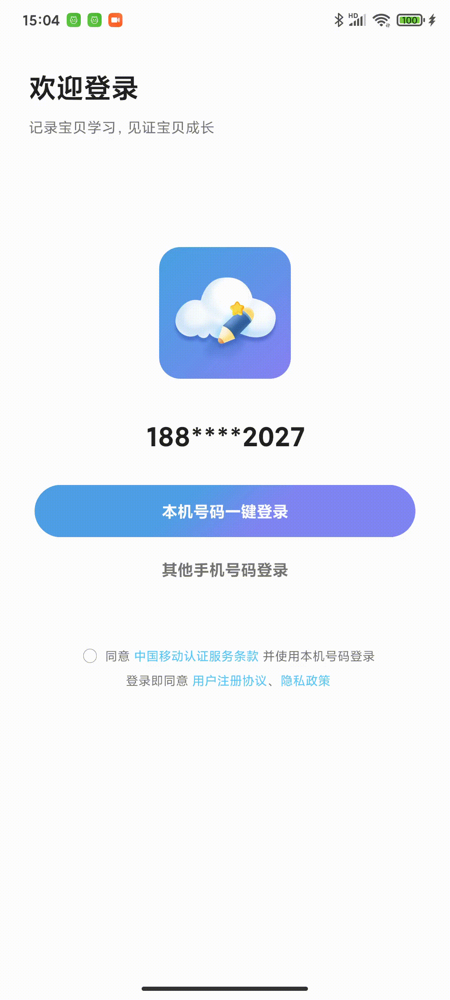
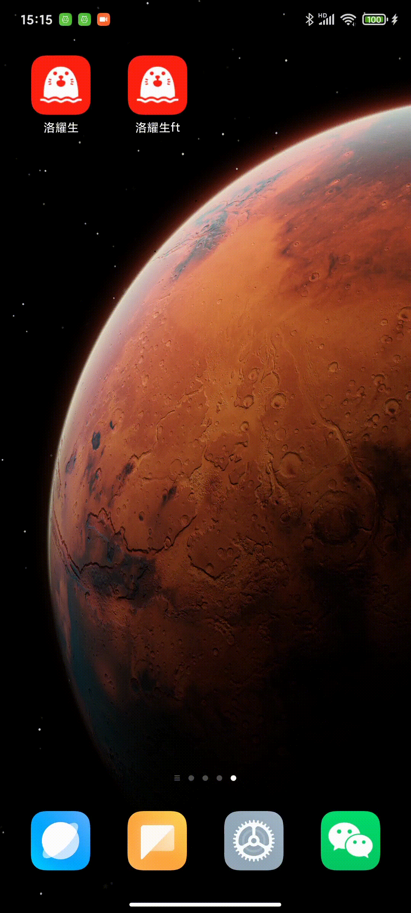

# FullStack
Full-stack development foundation example, can be based on this for new project development, have a nice day

#### WorldPeaceIOS

#### WorldPeaceAndroid

#### world_peace_flutter_iOS

#### world_peace_flutter_android

#### world_peace_vue_app

